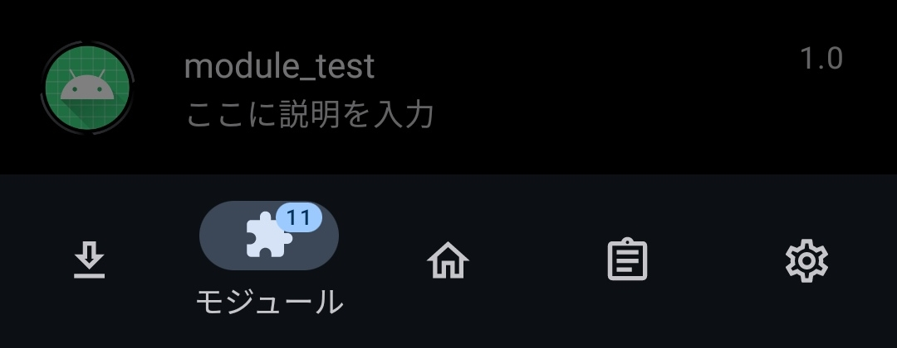

<!-- omit in toc -->
# Xposed_module.apk

- [注意](#注意)
- [環境構築](#環境構築)
  - [LSPosedの導入](#lsposedの導入)
- [Xposed moduleの作成](#xposed-moduleの作成)
  - [プロジェクトの作成](#プロジェクトの作成)
  - [Xposedで使うための設定](#xposedで使うための設定)
- [処理の記述](#処理の記述)
- [蛇足](#蛇足)

## 注意

私は泥に関する知識がまったくないです

多分何かしら間違ってます　ゆるして

## 環境構築

必要なもの

- [Android Studio](https://developer.android.com/studio)
- Root化済みのAndroid端末

~~泥側の環境構築に関しては割愛します~~

### LSPosedの導入

Zygisk（Magisk v24以降）

- [Releases · topjohnwu/Magisk](https://github.com/topjohnwu/Magisk/releases)

Magisk Managerの設定からZigiskを有効にする

LSPosed

- [Releases · LSPosed/LSPosed](https://github.com/LSPosed/LSPosed/releases)
- [LSPosedArchives（Telegram）](https://t.me/LSPosedArchives)

zygisk-release.zipを落としてMagiskからインスコ

## Xposed moduleの作成

### プロジェクトの作成

ファイル -> 新規 -> 新規プロジェクトから空のプロジェクトを選択、作成

### Xposedで使うための設定

`settings.gradle` を開く

```gradle
dependencyResolutionManagement {
    repositoriesMode.set(RepositoriesMode.FAIL_ON_PROJECT_REPOS)
    repositories {
        google()
        mavenCentral()
        maven { url "https://api.xposed.info/" }
    }
}
```

↑ `maven { url "https://api.xposed.info/" }` を追加する

`app/build.gradle` を開く

```gradle
dependencies {
    compileOnly  'de.robv.android.xposed:api:82'
    compileOnly  'de.robv.android.xposed:api:82:sources'
}
```

↑の文を追加する

`app/src/main/AndroidManifest.xml` を開く

```xml
<application>

    <meta-data
        android:name="xposedmodule"
        android:value="true" />
    <meta-data
        android:name="xposeddescription"
        android:value="ここに説明を入力" />
    <meta-data
        android:name="xposedminversion"
        android:value="82" />

</application>
```

↑の文を追加（各値は場合によって変わる）

ビルドできたら多分成功

この時点でLSPosed側からモジュールとして認識されるはす（有効化はできない）



ここからモジュール本体のコードを書いていく（予定）

## 処理の記述

工事中……

## 蛇足

How to make Xposed module　で検索するといくつか記事が出てくるけど

どの記事も`settings.gradle`の記述が

```gradle
repositories {
    jcenter()
}

dependencies {
    provided 'de.robv.android.xposed:api:82'
    provided 'de.robv.android.xposed:api:82:sources'
}
```

こんな感じになってる

実際にAndroid Studioで書いてみると

>JCenter Maven repository is no longer receiving updates: newer library versions may be available elsewhere

こんな警告がでる

調べてみるとJCenterなるライブラリのレポジトリを担うサービスが終了したとのこと

（つまりJCenterはPyPIとかnpmとかの認識でいいのかな……？）

一応読み取り専用で使えているらしいけどいつまで使えるかも不確定なので極力使わない方が無難

dependenciesの行では

>provided is deprecated; replace with compileOnly

と言われる

「providedは非推奨の書き方だからcompileOnlyに変えてね」とのこと
