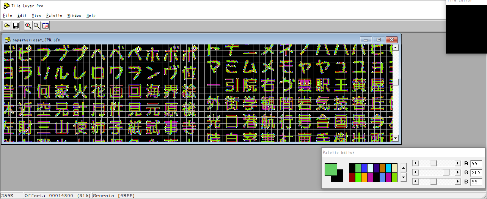

# temp

## R8PJ01

[フォーラムの投稿](http://nintendoclub.ru/forum/32-1512-13)（[魚拓](https://archive.ph/L6Njq)）を参照

`font\papermarioset_[EU|JPN|US].bfn`

[Tile Layer Pro](https://segaretro.org/Tile_Layer_Pro)でbfnを読み込む

View -> FormatをGenesisに変更、窓を横に延ばす

↑こんな感じ
